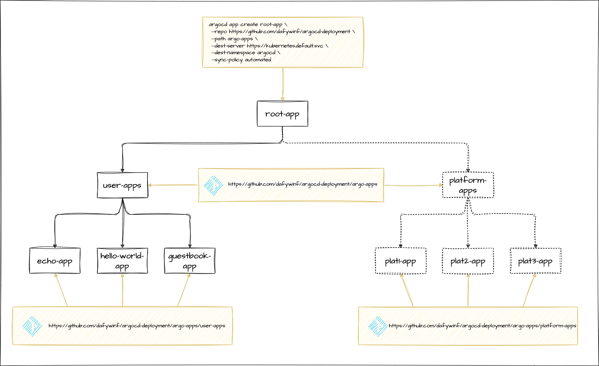
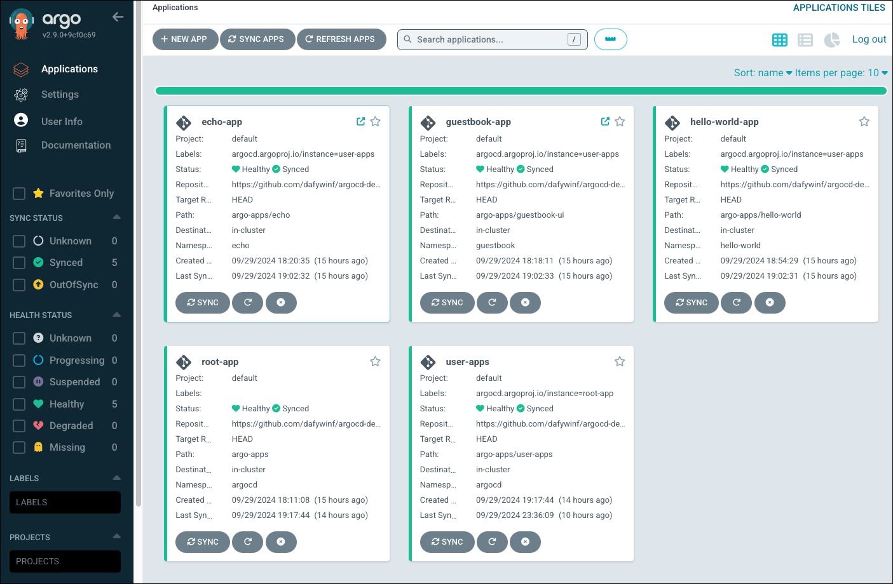

# ArgoCD Echo Deployment

## Pre-conditions

Local machine must be setup with helm, kubectl, argocd

```bash
brew install helm
brew install kubectl
brew install argocd
```

Kubectl must be configured to have access to the target cluster:

```bash
kubectl cluster-info
```

## ArgoCD installation

Execute:

```bash
sh ./deploy-argo-sh
```

## Installation Explanation

The wrapper script `sh/deploy-argo.sh` is broken down into multiple stages.

### verifyDependencies

Validates the helm, kubectl and argocd are correctly installed on the local machine.

### installArgoCD

The `installArgoCD` function automates the deployment of ArgoCD using Helm and follows these steps:

1. The Argo Helm repository is added and updated to ensure the latest chart versions are available. It refreshes the
   local index (on your development machine) of available charts, which is important to ensure that you're installing or
   upgrading to the latest
   stable versions of ArgoCD and any other components.
2. If an existing ArgoCD release exists in the specified namespace ($ARGO_NAMESPACE), it is uninstalled.
3. ArgoCD is installed with the following custom settings:
    * **Naming Convention:** Sets fullnameOverride=argocd to maintain consistent resource names. Using
      `fullnameOverride=argocd` simplifies the naming of the deployed resources, ensuring consistency and making it
      easier to reference the services.
    * **Disabled Features:** Disables the ApplicationSet controller, notifications, and Dex for resource optimisation.
    * **Custom Kustomize Options:** Removes Kustomize's load restrictions for more flexible handling of manifests.
4. The function monitors the ArgoCD server's deployment status to ensure successful rollout.

### setupSelfManagedArgoCD

Deploy the ArgoCD Application resource. This Helm chart defines an ArgoCD Application resource that automates the
deployment and management of the ArgoCD application itself within a Kubernetes cluster.

1. **Apply the ArgoCD Helm Chart** The chart specifies an ArgoCD Application using the Application CRD provided by
   ArgoCD. This application will manage the deployment of ArgoCD, allowing ArgoCD to manage itself, following a GitOps
   approach. The configuration includes syncing policies, source configurations, and custom Helm values to control how
   the ArgoCD components (such as the repo server, Dex, and Redis) are deployed and configured.
2. After applying the Helm chart, the script retrieves the initial admin password for ArgoCD from the Kubernetes secret
   and decodes it.
3. **Log In to ArgoCD:** The script then logs into ArgoCD using the retrieved admin credentials. It attempts to log in
   until successful.
4. **Synchronise the ArgoCD Application:** The script attempts to synchronise the ArgoCD-managed application, retrying
   every 10 seconds until successful. ArgoCD can automatically synchronise applications without requiring manual
   intervention, and this automatic synchronization can be enabled using automated sync policies. However, in the script
   you provided, the ArgoCD app sync command is being used manually to ensure that the synchronization happens
   explicitly within the script.
5. **Check the Rollout Status of ArgoCD Repository Server:** Lastly, the script monitors the rollout status of the
   ArgoCD repository server to ensure the deployment is complete and successful.

## Echo Example

Create Namespace and ArgoCD application:

```bash
kubectl create namespace echo

argocd app create echo --repo https://github.com/dafywinf/argocd-deployment.git \
  --path argo-apps/echo --dest-server https://kubernetes.default.svc --dest-namespace echo \
  --sync-policy auto
```

Delete ArgoCD application and Namespace:

```bash
argocd app delete echo --yes
kubectl delete namespace echo
```

## Guestbook UI Example

We have configured the Ingress for Guestbook UI to match paths beginning `/guestbook`. However, the Guestbook containers
are running Apache2 to render the Guest Book web pages. Content is stored within the container in `/var/www/html`and
the main page is `index.html`. However, we need to ensure that the path prefix `/guestbook` is stripped by the time the
request reaches the pods. In Traefik, this can be done using Middleware, specifically the StripPrefix middleware, which
strips part of the path before forwarding the request to the backend service.

The following middleware is deployed:

```bash
apiVersion: traefik.containo.us/v1alpha1
kind: Middleware
metadata:
  name: strip-prefix
spec:
  stripPrefix:
    prefixes:
      - "/guestbook-ui"
```

This middleware needs to be enabled on the ingress.

```bash
apiVersion: networking.k8s.io/v1
kind: Ingress
metadata:
  name: guestbook-ui
  annotations:
    ingress.kubernetes.io/ssl-redirect: "false"
    traefik.ingress.kubernetes.io/router.entrypoints: web

    # NOTE: The middleware needs to be prefixed with namespace (guestbook) unless in default
    traefik.ingress.kubernetes.io/router.middlewares: guestbook-strip-prefix@kubernetescrd
...
```

‼️ It was quite challenging to get this to work. The key challenge is noted in the comment above. The
middleware needs to be prefixed with the namespace it is deployed within. In this case the namespace is `guestbook`,
therefore we have `guestbook-strip-prefix@kubernetescrd` to example middleware `strip-prefix`.

To Create Namespace and ArgoCD application:

```bash
kubectl create namespace guestbook

argocd app create guestbook --repo https://github.com/dafywinf/argocd-deployment.git \
  --path argo-apps/guestbook-ui --dest-server https://kubernetes.default.svc --dest-namespace guestbook \
  --sync-policy auto
```

Delete ArgoCD application and Namespace:

```bash
argocd app delete guestbook --yes
kubectl delete namespace guestbook
```

## App-of-Apps Example

Deploys:

* Echo App
* Guestbook UI App
* Hello World App

```bash
 argocd app create root-app \
  --repo https://github.com/dafywinf/argocd-deployment \
  --path argo-apps \
  --dest-server https://kubernetes.default.svc \
  --dest-namespace argocd \
  --sync-policy automated
```

The above command will create the `root-app` ArgoCD Application, which points to the `argo-apps` directory within the
Git repository. This directory contains the `user-apps.yaml` file, which defines another ArgoCD Application called
`user-apps`.

The `user-apps` Application, in turn, monitors the `argo-apps/user-apps` directory, which contains application
definitions for the `echo-app`, `hello-world-app`, and `guestbook-ui-app`. Each of these applications monitors its
respective directory within `argo-apps`, where the manifest files for their Kubernetes resources are stored.

The advantage of this structure is that it allows us to use GitOps practices to manage and add components at any level
of the hierarchy. For example, we could add a `team1-apps.yaml` file in the `argo-apps` directory to create another App
of Apps structure specifically for **team1**, enabling the management of multiple teams' applications within the same
GitOps framework.





ℹ️ **Note:** Manifests do not have to reside in the same Git repository. **Team 1** could have a different repo for
their apps.

# Appendix

## References

* https://medium.com/@jojoooo/deploy-infra-stack-using-self-managed-argocd-with-cert-manager-externaldns-external-secrets-op-640fe8c1587b
* https://medium.com/devopsturkiye/self-managed-argo-cd-app-of-everything-a226eb100cf0